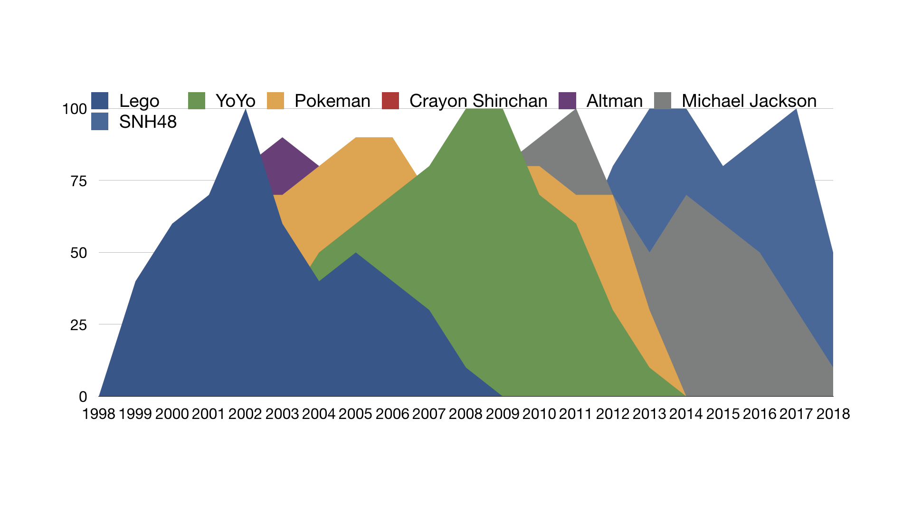

# Internet Famous Blog
This is a blog made by Lihao Wang to document the reading responses and homework in Internet Famous class.

## Week 5 reading response
The reading examines the phenomenon of smart fan and backyard wrestling in American culture. Those people who are enthusiastic about wrestling becomes so called “smart fans”. And they started organizing their own events, imitating what they saw on television. This is really interesting that smart fans are actually forming another community in the fan community. In addition, smart fans and Marks are divided within the fan community. They have similar interests, but in different directions. 

In such Internet era, becoming a “smart fan” is relatively easy because people can get access to any resources they want on the Internet. Also, I think every fan would see themself as a smart fan and at the same time form different groups in the community. From my personal experience, sometimes smart fans can be quite “dangerous” or “creepy”. They would act arrogantly in the group and try to rule the others, simply because they seem to know more about the celebrity. 

## Week 4 reading response
The essay mainly examines the fact of fame-starved children at IMTA, a contest for children who want to become famous. At IMTA, there are a lot of agents looking for talents, “the next Ashton Kutcher or Elijah Wood”. The settings of IMTA is very much like American Idol and it is believed that “American Idol is really helping the talent-convention industry”.  Besides the agents, kids' mothers are there, trying to capture every moment of their kids. 

I don't think it's a healthy phenomenon when kids are craving for fame. Usually, what they saw is one side of the fame. It's not easy to maintain the fame, even for kids. Although it's quite easy to be famous in such an Internet Era, kids might not be prepared for byproducts come with the fame. As a celebrity, kid is being consumed by the public as a entertainment product. Sometimes even a adult celebrity cannot stand the pressure, not to mention kids. As mentioned by the author, “Hollywood is overpopulated with adult actors”. It is the industry itself that contributes to the phenomenon of kid celebrities. 

Overall, I don't feel like letting children become famous is a good idea, and it shouldn't be encouraged by parents. Some kid celebrities might seem glamorous, it is all about packaging. 

It is common to see the phenomenon of hillbilly in any culture, not limited in America. As mentioned in the reading, hillbilly is largely socially constructed. And it gives middle-class people chance to feel superior and “presume racism”. But what surprised me is that it becomes mainstream and even shown on TV shows. I don’t think it’s a good idea to consume hillbilly in that way because it would be misleading to the public and increase the inequality between classes. 

## Week 3 reading response
The author of the essay analyzed the fact that people are often judged by their appearance and ways they act. As a person born in “a classic black American migration family”, author experienced so much inequality in her life. “Life isn’t fair” is the sentence that is repeated again and again in the essay. And this is so true in such society. Personally speaking, I was taught to dress properly to fit the theme of the event since childhood. If I look “acceptable”, I would be treated better than those who look “presentable”. 

As mentioned by the author, the reason why “poor people make stupid, illogical decisions to buy status” is want to “belong to a group”. Also, we are not able to feel how “poor people” feel unless we are the poor. The way they think and act is largely different than us. 

However, I am curious about how this issue would relate to the fame on Internet. Because I think Internet is an open space where everyone could act as different personality. Even poor people can become famous by pretending they live a rich life while rich people could act like they are poor. 

## Week 3 homework
- [Pinterest Page](https://www.pinterest.com/leowang9863/celebrity-persona/)

## Week 2 reading response
Internet has made the barrier of creative career path even lower. Nowadays, everyone can post their content on platforms like YouTube, Twitter and Facebook to label themselves as content creators. I personally want to be a YouTuber several years ago. Although those great videos posted on YouTube seem to be easy and effortless, when I was making it myself, I could really felt the difficulty in it. As an individual creator, it’s hard to imagine the effort behind the work. So as an audience and consumer, I can totally understand the sponsored contents. 

From the podcast, I learned that followers doesn’t necessarily mean profit. People mostly care about the views. And it is super risky to rely on the platform because you don’t when it would end. It’s important to create your own IP(intellectual property) in order to fully control your content. 
	
As mentioned by one speaker in the podcast, “creativity and business should work together”. Business has its artist side because  business is a key factor that will make the creativity sustainable. If there’s no way to make money, this won’t be a healthy model. In addition, I totally agree with the last speaker who works as both a writer and a publisher. He is very practical about his work. He said working at the publisher can support him as a writer. As long as the model works, it’s a great way to produce creative work. 

## Week 2 homework (Jon Bernthal fanpage)
- [Jon Bernthal Fan Club](https://www.facebook.com/JonBernthalFanClub/?notif_id=1537212001974916&notif_t=scheduled_post_published&ref=notif)
- [Jon Bernthal video cut](https://www.youtube.com/watch?v=Dkwww_POkE4&feature=youtu.be)

## Week 1 reading response
In the article “The man who made Justin Bieber”, I learned a lot secrets behind Justin Bieber’s fame, and how he became world-wide famous. Although I grew up in China, I can still remember his song “Baby” was so popular that almost everyone was singing and imitating him. 

After reading this article, I found that Braun was a great businessman who is good at predicting the trend and using resources wisely. When the CD industry was starting to decline, he quickly gear toward the digital music industry and started using digital media to promote Justin Bieber. Also, he let Bieber continue posting videos in a certain way instead of letting him perform with other famous singers immediately after he discovered Bieber on YouTube. I found this decision really wise because he had to gather certain amount of fans online in order to promote him to a wider audience. And Internet is a perfect platform to gain fame quickly. 

Braun is also good at cross-promotion. He used Bieber’s fame to benefit other clients and it worked quite well. For instance, “Last month, he tweeted to introduce the world to Braun’s newest client, Madison Beer, a thirteen-year-old singer who resembles a baby Megan Fox. Within minutes, her name was trending worldwide”. Such strategy made Braun’s success like a snowball, continuously promoting new clients. 

While being a successful businessman, Braun was strict with his clients. For instance, when Bieber was late for a performance, Braun immediately called Bieber and yelled at him. Then he would point out his fault and “have somebody come to his house every workday”.

## Week 1 homework

